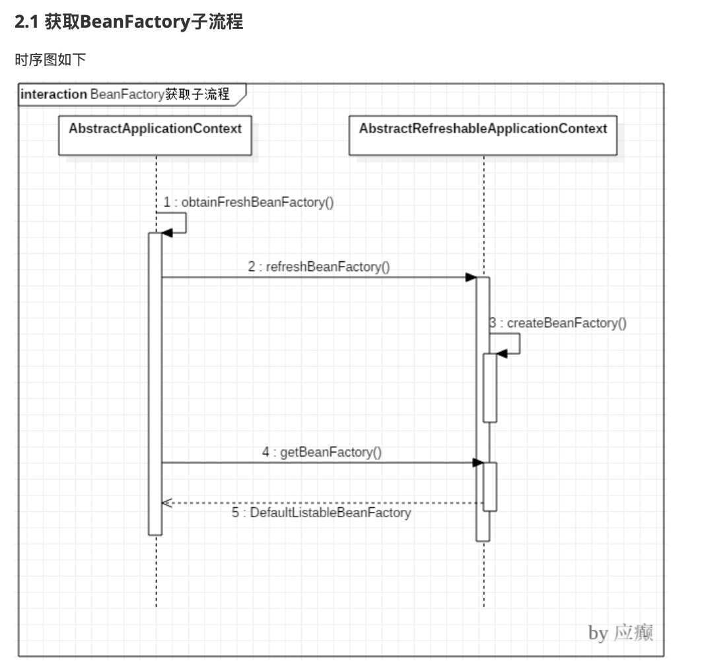

# Spring详解

# Spring

## 概述

### 简介

- Spring 是分层的 full-stack(全栈) 轻量级开源框架，以 IoC 和 AOP 为内核，提供了展现层 Spring MVC 和业务层事务管理等众多的企业级应用技术，还能整合开源世界众多著名的第三方框架和类库，已 经成为使用最多的 Java EE 企业应用开源框架。

### 优势

- 方便解耦，简化开发

	- 通过Spring提供的IoC容器，可以将对象间的依赖关系交由Spring进行控制，避免硬编码所造成的 过度程序耦合。用户也不必再为单例模式类、属性文件解析等这些很底层的需求编写代码，可以更 专注于上层的应用。

- AOP编程的支持

	-  通过Spring的AOP功能，方便进行面向切面的编程，许多不容易用传统OOP实现的功能可以通过AOP轻松应付。

- 声明式事务的支持 @Transactional

	- 可以将我们从单调烦闷的事务管理代码中解脱出来，通过声明式方式灵活的进行事务的管理，提高 开发效率和质量。

- 方便程序的测试

	- 可以用非容器依赖的编程方式进行几乎所有的测试工作，测试不再是昂贵的操作，而是随手可做的 事情。

- 方便集成各种优秀框架

	- Spring可以降低各种框架的使用难度，提供了对各种优秀框架(Struts、Hibernate、Hessian、 Quartz等)的直接支持。

- 降低JavaEE API的使用难度

	- Spring对JavaEE API(如JDBC、JavaMail、远程调用等)进行了薄薄的封装层，使这些API的使用难度大为降低。

- 源码是经典的 Java 学习范例

	- Spring的源代码设计精妙、结构清晰、匠心独用，处处体现着大师对Java设计模式灵活运用以及对Java技术的高深造诣。它的源代码无意是Java技术的最佳实践的范例。

### 核心结构

- Spring核心容器(Core Container) 容器

	- Spring框架最核心的部分，它管理着Spring应用中 bean的创建、配置和管理。在该模块中，包括了Spring bean工厂，它为Spring提供了DI的功能。 基于bean工厂，我们还会发现有多种Spring应用上下文的实现。所有的Spring模块都构建于核心 容器之上。

- 面向切面编程(AOP)/Aspects

	- Spring对面向切面编程提供了丰富的支持。这个模块是Spring应 用系统中开发切面的基础，与DI一样，AOP可以帮助应用对象解耦。

- 数据访问与集成(Data Access/Integration)

	- Spring的JDBC和DAO模块封装了大量样板代码，这样可以使得数据库代码变得简洁，也可以更专 注于我们的业务，还可以避免数据库资源释放失败而引起的问题。 另外，Spring AOP为数据访问 提供了事务管理服务，同时Spring还对ORM进行了集成，如Hibernate、MyBatis等。该模块由 JDBC、Transactions、ORM、OXM 和 JMS 等模块组成。

- Web 模块

	- 该模块提供了SpringMVC框架给Web应用，还提供了多种构建和其它应用交互的远程调用方 案。 SpringMVC框架在Web层提升了应用的松耦合水平。

- Test

	- 为了使得开发者能够很方便的进行测试，Spring提供了测试模块以致力于Spring应用的测 试。 通过该模块，Spring为使用Servlet、JNDI等编写单元测试提供了一系列的mock对象实现。

### 版本

- 5.x

	- JDK8+

- 4.x

	- JDK6+

- 3.x

	- JDK5+

- 目前稳定版本5.1.12

## 核心思想

### IOC

- 定义

	- IoC Inversion of Control (控制反转/反转控制)，注意它是一个技术思想，不是一个技术实现

- 控制反转

	- 控制:指的是对象创建(实例化、管理)的权利
	-  反转:控制权交给外部环境了(spring框架、IoC容器)

- 解决什么问题

	- IoC解决对象之间的耦合问题

- IOC与DI区别

	- DI:Dependancy Injection(依赖注入)
	- IOC和DI描述的同一件事情（对象实例化及依赖关系维护），只是角度不同
	- IOC站在对象的角度，对象实例化机器管理的权利交给了（反转）给了容器
	- DI是站在容器角度，容器会把对象依赖的其他对象注入（送进去），比如A对象实例化过程中因为声明了一个B类型的属性，name就需要容器把B对象注入给A

### AOP

- 定义

	- AOP: Aspect oriented Programming 面向切面编程/面向方面编程
	- AOP是OOP的延续

		- OOP

			- 封装、继承和多态
			- oop是一种垂直继承体系
			- 无法解决顶级父类代码重复

- 解决什么问题

	- 在不改变原有业务逻辑情况下，增强横切逻辑代码，根本上解耦合，避免横切逻辑代码重复

- 切/面理解

	- 「切」:指的是横切逻辑，原有业务逻辑代码我们不能动，只能操作横切逻辑代码，所以面向横切逻辑
	- 「面」:横切逻辑代码往往要影响的是很多个方法，每一个方法都如同一个点，多个点构成面，有一个 面的概念在里面

## 应用

### IOC

- 基础

	- beans.xml

		- 定义需要实例化对象的类的全限定雷鸣以及类之间依赖关系的描述

	- BeanFactory

		- IOC容器，通过反射技术实例化对象并维护对象之间的依赖关系

	- Spring框架的IOC实现

		- 纯xml（bean信息定义全部配置在xml中）
		- xml+注解 部分bean使用xml定义，部分bean使用注解定义
		- 纯注解模式 所有bean都是注解来定义

			- JavaSE应用

				- ApplicationContext context = new AnnotationConfigApplicationContext(SpringConfig.class)

			- JavaWeb应用

				- ContextLoaderListener（监听器去加载注解配置类）

	- BeanFactory、ApplicationContext

		- BeanFactory是Spring框架中IoC容器的顶层接口,它只是用来定义一些基础功能,定义一些基础规范,而 ApplicationContext是它的一个子接口，所以ApplicationContext是具备BeanFactory提供的全部功能 的。
		- 通常，我们称BeanFactory为SpringIOC的基础容器，ApplicationContext是容器的高级接口，比 BeanFactory要拥有更多的功能，比如说国际化支持和资源访问(xml，java配置类)等等

	- IOC实现方法详解

		- 纯xml

			- 实例化Bean的三种方式

				- 使用无参构造函数

					- <bean id="userService" class="com.lagou.service.impl.TransferServiceImpl"> </bean>
					- 它会通过反射调用无参构造函数来创建对象。如果类中没有无参构造函数，将创建 失败。

				- 静态方法创建

					- <bean id="userService" class="com.lagou.factory.BeanFactory" factory-method="getTransferService"></bean>

				- 实例化方法创建

					- <bean id="beanFactory" class="com.lagou.factory.instancemethod.BeanFactory"></bean> <bean id="transferService" factory-bean="beanFactory" factory- method="getTransferService"></bean>

			- Bean标签属性

				- id

					- 用于给bean提供一个唯一标识。在一个标签内部，标识必须唯一。

				- class

					- 用于指定创建Bean对象的全限定类名。

				- name

					- 用于给bean提供一个或多个名称。多个名称用空格分隔。

				- factory-bean

					- 用于指定创建当前bean对象的工厂bean的唯一标识。当指定了此属性之后， class属性失效。

				- factory-method

					- 用于指定创建当前bean对象的工厂方法，如配合factory-bean属性使用， 则class属性失效。如配合class属性使用，则方法必须是static的。

				- scope

					- 用于指定bean对象的作用范围。通常情况下就是singleton。当要用到多例模式时， 可以配置为prototype。

				- init-method

					- 用于指定bean对象的初始化方法，此方法会在bean对象装配后调用。必须是 一个无参方法。

				- destory-method

					- 用于指定bean对象的销毁方法，此方法会在bean对象销毁前执行。它只 能为scope是singleton时起作用。

			- DI

				- 构造函数注入

					- 顾名思义，就是利用带参构造函数实现对类成员的数据赋值
					- constructor-arg

						- name:用于给构造函数中指定名称的参数赋值。
						- index:用于给构造函数中指定索引位置的参数赋值。
						- value:用于指定基本类型或者String类型的数据。
						- ref:用于指定其他Bean类型的数据。写的是其他bean的唯一标识。

				- set方法注入

					- 它是通过类成员的set方法实现数据的注入。(使用最多的)
					- property

						- name:指定注入时调用的set方法名称。(注:不包含set这三个字母,druid连接池指定属性名称)
						- value:指定注入的数据。它支持基本类型和String类型。
						-  ref:指定注入的数据。它支持其他bean类型。写的是其他bean的唯一标识。

					- <property name"name" value="zhangsan"/>

		- xml和注解

			- bean声明

				- @Component("accountDao")，注解加在类上 bean的id属性内容直接配置在注解后面如果不配置，默认定义个这个bean的id为类 的类名首字母小写; 另外，针对分层代码开发提供了@Componenet的三种别名@Controller、 @Service、@Repository分别用于控制层类、服务层类、dao层类的bean定义，这 四个注解的用法完全一样，只是为了更清晰的区分而已

			- 标签scope

				- @Scope("prototype")，默认单例，注解加在类上

			- init- method

				- @PostConstruct，注解加在方法上，该方法就是初始化后调用的方法

			- destory- method

				- @PreDestory，注解加在方法上，该方法就是销毁前调用的方法

			- DI

				- @Autowired

					- 按照类型注入。
					- @Qualifier

						- 当一个类型有多个bean值的时候，Qualifier告诉Spring具体去装配哪个对象

					- org.springframework.beans.factory.annotation.Autowired

				- @Resource

					-  javax.annotation.Resourc
					- ByName

						- 默认

					- ByType
					- 设定

						- name、type

							- 找到唯一匹配bean，找不到抛异常

						- name

							- 名称匹配，找不到抛异常

						- type

							- 类型匹配唯一bean,找不到或多个抛异常

		- 纯注解

			- @Configuration

				- 注解，表名当前类是一个配置类

			- @ComponentScan

				- 注解，替代 context:component-scan

			- @PropertySource

				- 引入外部属性配置文件

			- @Import

				- 引入其他配置类

			- @Value

				- 对变量赋值，可以直接赋值，也可以使用 ${} 读取资源配置文件中的信息 @Bean 将方法返回对象加入 SpringIOC 容器

- 高级

	- lazy-Init 延迟加载

		- ApplicationContext 容器的默认行为是在启动服务器时将所有 singleton bean 提前进行实例化。提前 实例化意味着作为初始化过程的一部分，ApplicationContext 实例会创建并配置所有的singleton bean。
		- 设置 lazy-init 为 true 的 bean 将不会在 ApplicationContext 启动时提前被实例化，而是第一次向容器
		- 通过 getBean 索取 bean 时实例化的。
		- scope="pototype"

			-  lazy-init="false"，容器启动时也不 会实例化bean，而是调用 getBean 方法实例化的。

		- 应用

			- (1)开启延迟加载一定程度提高容器启动和运转性能
			- (2)对于不常使用的 Bean 设置延迟加载，这样偶尔使用的时候再加载，不必要从一开始该 Bean 就占 用资源

	- BeanFactory

		- 容器的顶级接口，定义了容器的一些基础行为，负责生产和管理Bean的一个工厂，
		- 具体使用它下面的子接口类型，比如ApplicationContext

	- FactoryBean

		- actoryBean可以生成某一个类型的Bean实例(返回给我们)，也就是说我们可以借助于它自定义Bean的创建过程。
		-  
	// 可以让我们自定义Bean的创建过程(完成复杂Bean的定义) public interface FactoryBean<T> {
	@Nullable
	// 返回FactoryBean创建的Bean实例，如果isSingleton返回true，则该实例会放到Spring容器 的单例对象缓存池中Map
  T getObject() throws Exception;
	@Nullable
	// 返回FactoryBean创建的Bean类型 Class<?> getObjectType();
	// 返回作用域是否单例
	default boolean isSingleton() {
    return true;
  }
	}

	- 后置处理器

		- BeanPostProcessor
		- BeanFactoryPostProcessor

	- Spring Bean的生命周期

		- 1)根据配置情况调用 Bean 构造方法或工厂方法实例化 Bean。
		- 2)利用依赖注入完成 Bean 中所有属性值的配置注入。
		- 3)如果 Bean 实现了 BeanNameAware 接口，则 Spring 调用 Bean 的 setBeanName() 方法传入当前 Bean 的 id 值。
		-  4)如果 Bean 实现了 BeanFactoryAware 接口，则 Spring 调用 setBeanFactory() 方法传入当前工厂实例的引用。
		-  5)如果 Bean 实现了 ApplicationContextAware 接口，则 Spring 调用 setApplicationContext() 方法传入当前 ApplicationContext 实例的引用。
		- 6)如果 BeanPostProcessor 和 Bean 关联，则 Spring 将调用该接口的预初始化方法postProcessBeforeInitialzation() 对 Bean 进行加工操作，此处非常重要，Spring 的 AOP 就是利用它实现的。
		-  7)如果 Bean 实现了 InitializingBean 接口，则 Spring 将调用 afterPropertiesSet() 方法。
		- 8)如果在配置文件中通过 init-method 属性指定了初始化方法，则调用该初始化方法。
		- 9)如果 BeanPostProcessor 和 Bean 关联，则 Spring 将调用该接口的初始化方法 postProcessAfterInitialization()。此时，Bean 已经可以被应用系统使用了。
		- 10)如果在 <bean> 中指定了该 Bean 的作用范围为 scope="singleton"，则将该 Bean 放入 Spring IoC 的缓存池中，将触发 Spring 对该 Bean 的生命周期管理;如果在 <bean> 中指定了该 Bean 的作用范围为 scope="prototype"，则将该 Bean 交给调用
		- 11)如果 Bean 实现了 DisposableBean 接口，则 Spring 会调用 destory() 方法将 Spring 中的 Bean 销毁;如果在配置文件中通过 destory-method 属性指定了 Bean 的销毁方法，则 Spring 将调用该方法对 Bean 进行销毁。

	- BeanDefinition

		- Spring容器启动的过程中，会将Bean解析成Spring内部的BeanDefinition结构
		-   其实就是将Bean的定义信息存储到这个BeanDefinition相应的属性中，后面对Bean的操作就直接对BeanDefinition进行，
		- 例如拿到这个BeanDefinition后，可以根据里面的类名、构造函数、构造函数参数，使用反射进行对象创建。

### AOP

## 源码

### IOC

- 源码编译

	- core-oxm-context-beans-aspects-aop
	- Task-》other-》compileTestJava

- IOC容器初始化

	- BeanFactory

		- 顶层容器(根容器)，不能被实例化，定义容器基本功能
		- 创建流程

	- 构造器执行、初始化方法执行、Bean后置处理器的before/after方法

		- AbstractApplicationContext#refresh#finishBeanFactoryInitialization

	- Bean工厂后置处理器初始化、方法执行

		- AbstractApplicationContext#refresh#invokeBeanFactoryPostProcessors

	- Bean后置处理器初始化

		- AbstractApplicationContext#refresh#registerBeanPostProcessors

	- AbstractApplicationContext#refresh

		- prepareRefresh

			- 环境准备

		- obtainFreshBeanFactory

			- 获取BeanFactory：默认实现是DefaultListableBeanFactory

				- 是否存在，已存在，销毁
				- refreshBeanFactory

					- new DefaultListableBeanFactory
					- loadBeanDefinitions

				- getBeanFactory
				- 

			- 加载BeanDefition并注册到BeanDefitionRegistry

		- prepareBeanFactory

			- BeanFactory前置处理器

		- postProcessBeanFactory

			- BeanFacotry后置处理器

		- invokeBeanFactoryPostProcessors

			- 实例化postProcessBeanFactory，并调用接口方法

		- registerBeanPostProcessors

			- 注册BeanPostProcessor bean的后置处理器，创建bean的前后执行

		- finishBeanFactoryInitialization

			- 初始化所有剩下的非懒加载的单例bean
			- 初始化创建非懒加载方式的单例Bean实例
			- 填充属性
			- 初始化方法调用
			- 调用BeanPostProcessor后置处理器对实例bean进行后置处理

### AOP

*XMind: ZEN - Trial Version*

